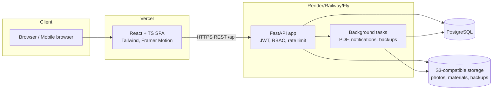
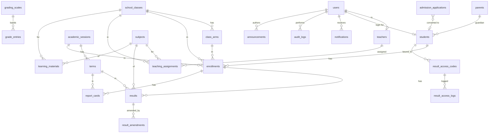
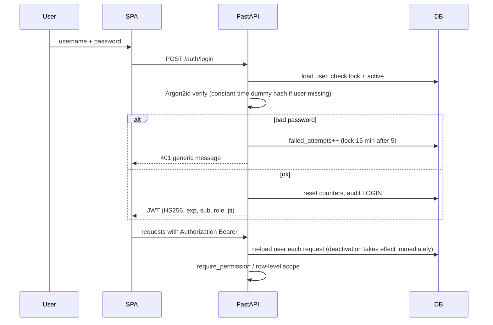
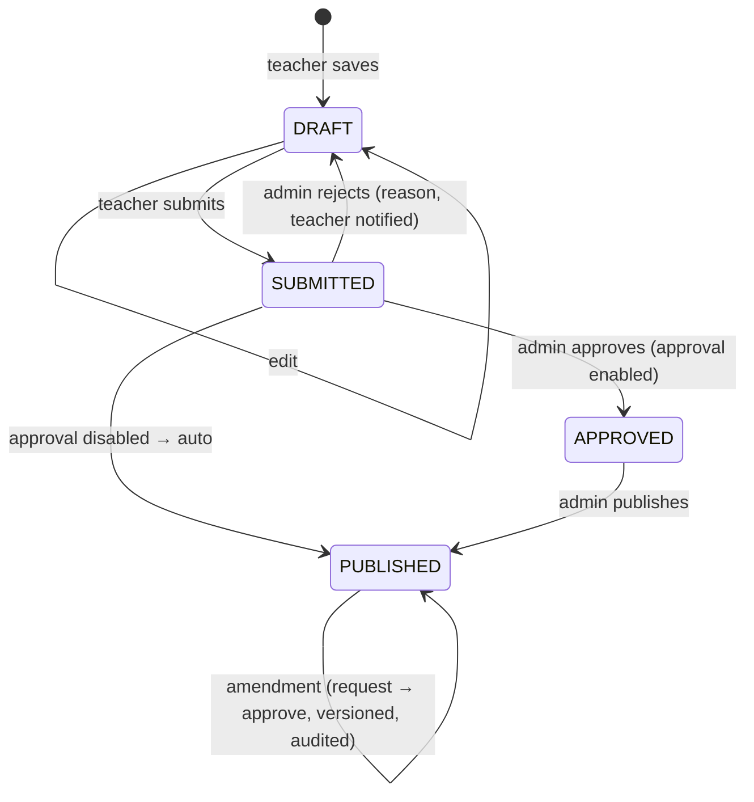

# School Website & Student Management Portal — Architecture

Target: a Nigerian primary/secondary school. Public website + secure management portal.
Stack: React + TypeScript + Tailwind (Vercel) · FastAPI + SQLAlchemy (Render/Railway/Fly) · PostgreSQL (prod) / SQLite (dev) · S3-compatible object storage.

## 0. Assumptions (documented decisions)

| # | Assumption |
|---|-----------|
| A1 | One school per deployment (single tenant). School identity lives in `school_settings` (one row). |
| A2 | "Student/Parent" is one role, `STUDENT`. A parent signs in with the ward's login. `parents` is a data table linked to students (guardian contact data), not a separate login. |
| A3 | `results` stores one **subject score record** per student × subject × term (this is the unit that goes through DRAFT → PUBLISHED). `report_cards` stores one **per-student-per-term summary** (verification reference, remarks, publish date). Average, total, position and overall grade are *derived* from published `results` at read time, so they can never drift out of sync. This merges the brief's `results`/`result_items` into two clearer tables. |
| A4 | Because different teachers teach different subjects, workflow state is per subject record, not per whole report card. A report card becomes visible to students as soon as at least one subject is PUBLISHED; only PUBLISHED subjects are ever shown. |
| A5 | Result scratch-card PINs are stored only as keyed hashes (HMAC-SHA256 with a server pepper). The plaintext PIN is shown **once**, at generation. Cards can be printed/exported at that moment (or re-printed by re-supplying serial+PIN, which the server verifies against the hash). |
| A6 | A code bound to no student is bound to the first student who successfully uses it (standard scratch-card behaviour). A code bound to a student or term only works for that student/term. Every successful check consumes one use (`max_uses`, default 5). |
| A7 | Access tokens are short-lived JWTs sent in the `Authorization` header (not cookies), so classic CSRF does not apply; there is no ambient credential for a forged cross-site request to ride on. Tokens are kept in `sessionStorage`. Strict CSP + output escaping (React) mitigate XSS. A rotating refresh token is out of scope; sessions last 8 h by default. |
| A8 | Permissions: a default role→permission map ships in code. SUPER_ADMIN may edit the map for ADMIN/TEACHER/STUDENT in the UI (stored in `role_permissions`). SUPER_ADMIN always has every permission. Row-level scoping (teacher sees only own classes, student sees only self) is enforced in code regardless of permissions. |
| A9 | Rate limiting for result checking and login uses database-backed counters (`result_access_logs`, `users.failed_attempts`) so it works across several server instances. A small in-memory limiter additionally protects other public endpoints (admission form, password reset). Use Redis for the latter when scaling beyond one instance. |
| A10 | Backups are logical JSON snapshots (gzip) stored in object storage and managed by SUPER_ADMIN. Managed PostgreSQL's native PITR remains the primary disaster-recovery mechanism. |
| A11 | Files are never served from a public path. Photos/materials are read through authorised API endpoints; S3 backends redirect to short-lived presigned URLs after the authorisation check. Antivirus scanning is a pluggable hook (`scan_upload`) — a no-op unless `CLAMAV_HOST` is configured. |
| A12 | Currency of "demo data": the seed script creates clearly-labelled demo accounts (`*.demo@…`) and refuses to run in `ENVIRONMENT=production` unless forced. |
| A13 | Phone numbers use Nigerian format validation (`0803…` or `+234803…`). |

## 1. System architecture



Backend layers: `routers` (HTTP + authorisation) → `services` (business rules: grading, result workflow, codes, PDF) → `models` (SQLAlchemy). Cross-cutting: `core` (config, security, deps, rate limit, storage, audit, notifications).

## 2. User-role matrix

Legend: ● full · ◐ scoped · ○ none

| Capability | SUPER_ADMIN | ADMIN | TEACHER | STUDENT |
|---|:-:|:-:|:-:|:-:|
| Manage admins | ● | ○ | ○ | ○ |
| Manage teachers | ● | ● | ○ | ○ |
| Manage students | ● | ● | ◐ view own classes | ◐ own profile (read) |
| Classes/arms/subjects/sessions/terms | ● | ● | ○ (read) | ○ |
| Teaching assignments | ● | ● | ○ (read own) | ○ |
| Grading scale & result workflow settings | ● | ● | ○ | ○ |
| Enter / edit draft results | ● | ● | ◐ assigned only | ○ |
| Submit results | ● | ● | ◐ assigned only | ○ |
| Approve / publish results | ● | ● | ◐ only if self-approval enabled | ○ |
| Amend published results | ● | ● | ◐ request only | ○ |
| Generate / manage result codes | ● | ● | ○ | ○ |
| View own results, history, PDF | — | — | — | ◐ own only |
| Learning materials: upload/manage | ● | ● | ◐ assigned class+subject | ○ |
| Learning materials: browse | ● | ● | ◐ | ◐ own class, published |
| Announcements: publish | ● | ● | ○ | read |
| Admissions review | ● | ● | ○ | ○ |
| Audit log | ● | ◐ (permission-gated) | ○ | ○ |
| School settings | ● | ◐ (permission-gated) | ○ | ○ |
| Reports | ● | ● | ◐ own classes | ○ |
| Backups | ● | ○ | ○ | ○ |
| Role-permission matrix | ● | ○ | ○ | ○ |

Permissions are string keys (e.g. `students.write`, `results.approve`, `codes.generate`); see `backend/app/core/permissions.py`.

## 3. Database ER diagram



## 4. Database schema (summary)

Primary keys are integer surrogate keys; every FK is indexed. `created_at/updated_at` on all mutable tables.

| Table | Key columns / constraints |
|---|---|
| `users` | username UQ, email UQ(nullable), password_hash (Argon2id), role, is_active, failed_attempts, locked_until, must_change_password, last_login_at |
| `password_reset_tokens` | user_id FK, token_hash UQ, expires_at, used_at |
| `teachers` | user_id FK UQ, staff_no UQ, qualification, phone |
| `parents` | full_name, phone, email, address, relationship |
| `students` | student_no UQ (auto `STU-YYYY-NNNN`), admission_no UQ, user_id FK UQ, parent_id FK, names, dob, gender, photo_key, address, admission_date, status (ACTIVE/INACTIVE/GRADUATED/WITHDRAWN), emergency contact, medical/other info. Indexes on names, status |
| `academic_sessions` | name UQ (`2026/2027`), start/end, is_current |
| `terms` | session_id FK, name, position, is_current, UQ(session_id, position) |
| `school_classes` | name UQ, level_order |
| `class_arms` | class_id FK, name, form_teacher_id FK, UQ(class_id, name) |
| `subjects` | name UQ, code UQ, category |
| `enrollments` | student_id, session_id, class_id, arm_id, status, UQ(student_id, session_id) |
| `teaching_assignments` | teacher_id, session_id, class_id, arm_id NULL (=all arms), subject_id, UQ(...) |
| `grading_scales` / `grade_entries` | is_active; grade, description, min_score, max_score, grade_point, remark; CHECK min ≤ max |
| `results` | enrollment_id, subject_id, term_id UQ together; ca_score, exam_score, total, grade, grade_description, grade_point, teacher_remark, status, version, entered_by, submitted_*, approved_*, published_*, rejection_reason. CHECK scores ≥ 0. Index (term_id, status), (subject_id, term_id) |
| `result_amendments` | result_id, requested_by, old/new ca & exam, reason, status (PENDING/APPROVED/REJECTED), decided_by, decided_at |
| `report_cards` | enrollment_id, term_id UQ together; verification_ref UQ, teacher_remark, principal_remark, first_published_at |
| `result_access_codes` | serial UQ (`RC-000145`), code_hash UQ, code_last4, batch_ref, session_id, term_id NULL, student_id NULL, max_uses, use_count, expires_at, is_active, created_by, first_used_at |
| `result_access_logs` | code_id NULL, student_id NULL, report_card_id NULL, success, reason, ip, user_agent, created_at; index (ip, created_at) |
| `learning_materials` | title, description, kind, subject_id, class_id, teacher_id, session_id, term_id, file_key, file_name, mime, size, text_content, visibility (DRAFT/PUBLISHED/ARCHIVED) |
| `announcements` | title, body, category, image_key, author_id, status, publish_at, expires_at, audience |
| `notifications` | user_id FK, title, message, link, is_read |
| `audit_logs` | user_id NULL, action, entity, entity_id, detail JSON, ip, user_agent, created_at; index (action), (entity, entity_id) |
| `school_settings` | single row: identity, colours, principal, assets, grading limits (ca_max, exam_max), workflow flags, code settings |
| `role_permissions` | role, permission UQ together |
| `admission_applications` | applicant + guardian data, class applied, status, reviewer, review_note, student_id |
| `backups` | file_key, size, created_by |

## 5. Folder structure

```
school-portal/
├─ docs/ARCHITECTURE.md
├─ backend/
│  ├─ app/
│  │  ├─ main.py                 FastAPI factory, middleware, headers, routers
│  │  ├─ core/                   config, db, security, deps, permissions,
│  │  │                          ratelimit, storage, uploads, audit, notify
│  │  ├─ models.py               SQLAlchemy models
│  │  ├─ schemas.py              Pydantic request/response models
│  │  ├─ services/               grading, results, codes, pdf
│  │  ├─ routers/                one module per resource
│  │  └─ seed.py                 demo data
│  ├─ alembic/                   migrations
│  ├─ tests/
│  ├─ requirements.txt  Dockerfile  render.yaml  .env.example
├─ frontend/
│  ├─ src/
│  │  ├─ lib/                    api client, auth context, utils
│  │  ├─ components/ui/          design system (Button, Card, Modal, Table …)
│  │  ├─ components/             layouts, charts, shared widgets
│  │  └─ pages/                  public/, auth/, admin/, teacher/, student/
│  ├─ vercel.json  .env.example
```

## 6. API endpoint specification

All under `/api`. JSON unless noted. `🔒` = bearer token required; permission shown in brackets.

**Auth** — `POST /auth/login` · `POST /auth/register` 🔒[users.write] (creates a user) · `GET /auth/me` 🔒 · `POST /auth/change-password` 🔒 · `POST /auth/forgot-password` · `POST /auth/reset-password`

**Users** 🔒 — `GET/POST /users` · `PUT /users/{id}` · `POST /users/{id}/activate|deactivate` · `POST /users/{id}/reset-password`

**Students** 🔒 — `GET /students` (q, class_id, arm_id, session_id, status, page) · `POST /students` · `GET/PUT /students/{id}` · `POST /students/{id}/photo` · `POST /students/{id}/deactivate|activate` · `POST /students/promote` · `GET /students/export.csv` · `GET /students/me`

**Teachers** 🔒 — `GET/POST /teachers` · `GET/PUT /teachers/{id}` · `GET/PUT /teachers/{id}/assignments` · `GET /teachers/me/overview`

**Academic** 🔒 — `GET/POST/PUT/DELETE /sessions`, `/sessions/{id}/terms`, `/terms/{id}`, `/classes`, `/classes/{id}/arms`, `/arms/{id}`, `/subjects`; `POST /sessions/{id}/set-current`, `POST /terms/{id}/set-current`; `GET/PUT /grading-scale`

**Results** 🔒 — `GET /results` · `POST /results` · `POST /results/bulk` · `PUT /results/{id}` · `POST /results/{id}/submit` · `POST /results/{id}/approve` · `POST /results/{id}/reject` · `POST /results/{id}/publish` · `POST /results/batch/{action}` · `POST /results/{id}/amendments` · `GET /amendments` · `POST /amendments/{id}/approve|reject` · `GET /results/history` (student) · `GET /report-cards/{id}` · `GET /report-cards/{id}/pdf` · `PUT /report-cards/{id}/remarks` · `GET /reports/class-performance`

**Result codes** 🔒[codes.*] — `POST /result-codes/generate` · `GET /result-codes` · `GET /result-codes/export.csv` · `PUT /result-codes/{id}` · `GET /result-codes/{id}/logs` · `POST /result-codes/cards.pdf`

**Public** — `POST /results/check` · `GET /results/check/pdf?token=` · `GET /verify/{ref}` · `GET /public/school` · `GET /public/announcements` · `GET /public/sessions` · `POST /public/applications` · `GET /public/media/{kind}` (logo/stamp/signature)

**Materials** 🔒 — `GET/POST /materials` · `GET/PUT/DELETE /materials/{id}` · `GET /materials/{id}/download` · `GET /materials/subjects` (student subject tiles)

**Announcements** — `GET/POST /announcements` 🔒 · `PUT/DELETE /announcements/{id}`

**Notifications** 🔒 — `GET /notifications` · `POST /notifications/{id}/read` · `POST /notifications/read-all`

**Admin** 🔒 — `GET /audit-logs` · `GET/PUT /settings` · `POST /settings/assets/{logo|stamp|signature}` · `GET /dashboard` · `GET/PUT /permissions` · `GET/POST /backups`, `GET /backups/{id}/download` · `GET/PUT /applications`

## 7. Authentication flow



Password reset: `forgot-password` always returns 202; if the account exists a one-time 32-byte token (hash stored, 1 h expiry) is emailed (SMTP) or, in dev, written to the server log. `reset-password` consumes it. New accounts get a temporary password and `must_change_password=true`.

## 8. Result workflow



Rules enforced in `services/results.py`: teacher must hold a `teaching_assignment` for (class, arm, subject, session); only DRAFT editable; approver ≠ submitter unless `allow_self_approval`; PUBLISHED can only change via an approved amendment that stores old/new values, bumps `version` and writes an audit record. Totals/grades are always recomputed server-side from the active grading scale.

## 9. Scratch-card / result-code workflow

```mermaid
sequenceDiagram
  participant A as Admin
  participant API
  participant P as Parent
  A->>API: generate(qty, session, term?, max_uses, expiry, student?)
  API->>API: secrets.choice → SCH-XXXX-XXXX-XXXX (60+ bits, no ambiguous chars)
  API->>DB: store HMAC hash + serial + last4
  API-->>A: plaintext PINs (once) → print cards / CSV
  P->>API: /results/check {student id, PIN, session, term}
  API->>DB: throttle by IP + by student window
  API->>API: validate: active, not expired, uses left, session/term match, student match/bind
  API->>DB: log attempt (success or reason), use_count++
  API-->>P: report card + short-lived signed token for PDF
  Note over API,P: Any failure returns the same generic error; no student-existence leak
```

## 10. Learning-material workflow

Teacher/admin uploads (validated extension + MIME + magic-bytes + size) → file stored under a random key → record saved as DRAFT or PUBLISHED with class, subject, session, term → on publish, students enrolled in that class receive a notification. Students list only PUBLISHED materials for their current class; the download endpoint re-checks class visibility, so changing an id in the URL never exposes other classes' files. Subjects are shown as tiles (Mathematics, English …) each opening the filtered list.

## 11. Security architecture

* Argon2id password hashing; lockout after 5 failures; generic login errors; timing-equalised.
* JWT HS256 with secret from env, `exp`, `jti`; user re-loaded per request so deactivation is immediate.
* RBAC dependency `require_permission(...)` + row-level scoping helpers (teacher assignments, student self).
* Pydantic validation on all input; SQLAlchemy parameterised queries only (no string SQL).
* XSS: React escaping; no `dangerouslySetInnerHTML`; API sets `Content-Security-Policy`, `X-Content-Type-Options`, `X-Frame-Options`, `Referrer-Policy`, `Permissions-Policy`, HSTS in production; user text is stored raw and escaped at render/PDF.
* CSRF: bearer-header auth (A7); CORS restricted to configured origins.
* Uploads: extension allow-list, MIME allow-list, magic-byte sniffing for images/PDF, executable/script block-list, size caps, random storage names, private storage, authorised download only, optional AV hook.
* Result codes: `secrets` CSPRNG, HMAC-hashed at rest, rate-limited checks, uniform error messages, full attempt log.
* Audit log on all security-relevant actions with IP + user agent.
* Secrets only via environment variables; `.env` git-ignored; startup refuses default secrets in production.
* Errors: global handler returns generic 500 without stack traces.

## 12. Deployment architecture

| Piece | Platform | Notes |
|---|---|---|
| Frontend | Vercel | `VITE_API_URL` env; SPA rewrite in `vercel.json` |
| Backend | Render / Railway / Fly | Docker image; `uvicorn` ; health `/api/health`; env vars for secrets |
| DB | Managed PostgreSQL | `DATABASE_URL`; run `alembic upgrade head` at release |
| Storage | S3-compatible (Cloudflare R2, S3, Backblaze) | `STORAGE_BACKEND=s3` + bucket creds; local disk for dev |
| Email | SMTP provider | optional; falls back to log in dev |

Frontend and backend deploy independently; CORS origin is the only coupling.

## 13. UI page list

**Public:** Home · About · Admissions (info, FAQ, apply form) · Check Result · Verify Result · Announcements/News · Contact · Login · Forgot/Reset password.
**Admin/Super admin:** Dashboard · Students (list, register/edit, profile, promote) · Teachers (+assignments) · Classes & Subjects · Sessions & Terms · Results (entry, approvals, amendments) · Result Codes (generate, list, print) · Learning Materials · Announcements · Admissions · Notifications · Audit Log · Reports · Users · Permissions · Backups · Settings.
**Teacher:** Dashboard · My Classes & Students · Result Entry · Materials · Notifications.
**Student:** Dashboard · My Results/Academic History · Learning Materials · Announcements · Profile · Notifications.

## 14. Navigation structure

```
Public header:  Home · About · Admissions · News · Contact · [Check Result] [Student Portal]
Admin sidebar:  Dashboard
                People  → Students · Teachers · Users
                Academics → Sessions & Terms · Classes & Subjects · Results · Approvals · Reports
                Result Codes
                Content → Learning Materials · Announcements · Admissions
                System  → Notifications · Audit Log · Permissions · Backups · Settings
Teacher sidebar: Dashboard · My Classes · Enter Results · Learning Materials · Notifications
Student sidebar: Dashboard · My Results · Learning Materials · Announcements · Profile
```

## Build phases

Phases 1–15 from the brief are followed in order; each is verified with the automated test-suite (`pytest`) and the frontend type-check/build before moving on.
